```mermaid
classDiagram
    %% ========== BOOKING MANAGEMENT SERVICE ==========
    %% Controllers
    class BookingController {
        -bookingService: BookingService
        -kafkaProducerService: KafkaProducerService
        -messagingService: IMessagingService
        +PayDepositToBooking(BookingId): Task~IActionResult
        +PayTheRestToBooking(BookingId): Task~IActionResult
        +ProcessCancelRequest(BookingId, IsAccepted, request): Task~IActionResult
        +BookingDealing(BookingId, request): Task~IActionResult
        +AcceptBookingDealing(BookingId): Task~IActionResult
    }

    %% ========== MESSAGE HANDLERS ==========
    class BookingManagementDomainMessageHandler {
        -bookingService: BookingService
        -bookingProducingRequestService: BookingProducingRequestService
        -messagingService: IMessagingService
        -kafkaProducerService: KafkaProducerService
        +HandlerProcessBookingDepositPaymentAsync(key, messageJson): Task
        +HandleProcessBookingPayTheRestPaymentAsync(key, messageJson): Task
        +HandleValidateBookingProducingRequestCancellationAsync(key, messageJson): Task
        +HandleBookingDealingFlowAsync(key, messageJson): Task
        +HandleAcceptBookingDealingFlowAsync(key, messageJson): Task
    }

    %% ========== SERVICES - DB SERVICES ==========
    class BookingService {
        -messagingService: IMessagingService
        -kafkaProducerService: KafkaProducerService
        -accountCachingService: AccountCachingService
        +ProcessBookingDepositPaymentAsync(parameter, command): Task
        +ProcessBookingPayTheRestPaymentAsync(parameter, command): Task
        +ProcessBookingDealingAsync(parameter, command): Task
        +AcceptBookingDealingAsync(parameter, command): Task
        +ManualCancelBookingAsync(parameter, command): Task
    }

    class BookingProducingRequestService {
        -messagingService: IMessagingService
        -kafkaProducerService: KafkaProducerService
        +ValidateProducingRequestCancellationAsync(parameter, command): Task
        +CancelProducingRequestAsync(parameter, command): Task
        +CreateProducingRequestAsync(parameter, command): Task
    }

    %% ========== MESSAGING SERVICE ==========
    class IMessagingService {
        +SendSagaMessageAsync(message): Task~bool
    }

    class KafkaProducerService {
        +PrepareStartSagaTriggerMessage(topic, requestData, sagaInstanceId, messageName): SagaCommandMessage
        +PrepareSagaEventMessage(topic, requestData, responseData, sagaInstanceId, flowName, messageName): SagaEventMessage
    }

    %% ========== SAGA MESSAGE MODELS ==========
    class SagaCommandMessage {
        +SagaInstanceId: Guid
        +FlowName: string
        +MessageName: string
        +RequestData: JObject
        +LastStepResponseData: JObject
    }

    class SagaEventMessage {
        +SagaInstanceId: Guid
        +FlowName: string
        +MessageName: string
        +RequestData: JObject
        +ResponseData: JObject
    }

    %% ========== PARAMETER DTOs ==========
    class ProcessBookingDepositPaymentParameterDTO {
        +AccountId: int
        +BookingId: int
    }

    class ProcessBookingPayTheRestPaymentParameterDTO {
        +AccountId: int
        +BookingId: int
    }

    class ProcessBookingDealingParameterDTO {
        +AccountId: int
        +BookingId: int
        +BookingRequirementInfoList: List~object
        +DeadlineDayCount: int
    }

    class AcceptBookingDealingParameterDTO {
        +AccountId: int
        +BookingId: int
    }

    class CancelBookingManualParameterDTO {
        +AccountId: int
        +BookingId: int
        +BookingManualCancelledReason: string
    }

    class ValidateBookingCancellationParameterDTO {
        +AccountId: int
        +BookingId: int
        +IsAccepted: bool
        +CustomerBookingCancelDepositRefundRate: decimal
        +PodcastBuddyBookingCancelDepositRefundRate: decimal
    }

    %% ========== DATABASE ENTITIES (Chủ đạo) ==========
    class Booking {
        +Id: int
        +AccountId: int
        +PodcastBuddyId: int
        +Price: decimal?
        +BookingStatusTrackings: List~BookingStatusTracking
    }

    class BookingStatusTracking {
        +Id: int
        +BookingId: int
        +BookingStatusId: int
        +CreatedAt: DateTime
    }

    class BookingProducingRequest {
        +Id: int
        +BookingId: int
        +Status: string
    }

    %% ========== REQUEST/RESPONSE DTOs ==========
    class BookingCancelRequestDTO {
        +BookingCancelledReason: string
    }

    class BookingCancelValidationRequestDTO {
        +BookingCancelValidationInfo: BookingCancelValidationInfoDTO
    }

    class BookingDealingRequestDTO {
        +BookingDealingInfo: BookingDealingInfoDTO
    }

    class BookingCancelValidationInfoDTO {
        +CustomerBookingCancelDepositRefundRate: decimal
        +PodcastBuddyBookingCancelDepositRefundRate: decimal
    }

    class BookingDealingInfoDTO {
        +BookingRequirementInfoList: List~object
        +DeadlineDayCount: int
    }

    %% ========== CACHING & HELPER SERVICES ==========
    class AccountCachingService {
    }

    class AccountStatusCache {
        +Id: int
        +RoleId: int
        +Email: string
    }

    %% ========== RELATIONSHIPS ==========
    %% Controller Dependencies
    BookingController --> BookingService
    BookingController --> KafkaProducerService
    BookingController --> IMessagingService

    %% MessageHandler Dependencies
    BookingManagementDomainMessageHandler --> BookingService
    BookingManagementDomainMessageHandler --> BookingProducingRequestService
    BookingManagementDomainMessageHandler --> IMessagingService
    BookingManagementDomainMessageHandler --> KafkaProducerService

    %% Service Dependencies
    BookingService --> IMessagingService
    BookingService --> KafkaProducerService
    BookingService --> AccountCachingService
    BookingService --> Booking
    BookingService --> BookingStatusTracking

    BookingProducingRequestService --> IMessagingService
    BookingProducingRequestService --> KafkaProducerService
    BookingProducingRequestService --> BookingProducingRequest

    %% KafkaProducerService Dependencies
    KafkaProducerService --> SagaCommandMessage
    KafkaProducerService --> SagaEventMessage

    %% DTO Dependencies
    BookingController --> BookingCancelRequestDTO
    BookingController --> BookingCancelValidationRequestDTO
    BookingController --> BookingDealingRequestDTO
    BookingController --> ProcessBookingDepositPaymentParameterDTO
    BookingController --> ProcessBookingPayTheRestPaymentParameterDTO

    BookingManagementDomainMessageHandler --> ProcessBookingDepositPaymentParameterDTO
    BookingManagementDomainMessageHandler --> ProcessBookingPayTheRestPaymentParameterDTO
    BookingManagementDomainMessageHandler --> ProcessBookingDealingParameterDTO
    BookingManagementDomainMessageHandler --> AcceptBookingDealingParameterDTO
    BookingManagementDomainMessageHandler --> CancelBookingManualParameterDTO
    BookingManagementDomainMessageHandler --> ValidateBookingCancellationParameterDTO

    BookingService --> ProcessBookingDepositPaymentParameterDTO
    BookingService --> ProcessBookingPayTheRestPaymentParameterDTO
    BookingService --> ProcessBookingDealingParameterDTO
    BookingService --> AcceptBookingDealingParameterDTO
    BookingService --> CancelBookingManualParameterDTO
    BookingService --> SagaCommandMessage

    BookingProducingRequestService --> ValidateBookingCancellationParameterDTO
    BookingProducingRequestService --> CancelBookingManualParameterDTO
    BookingProducingRequestService --> SagaCommandMessage

    %% Account Dependencies
    BookingService --> AccountStatusCache
```

---

## Booking Management Class Diagram - Sequence Diagrams Overview

Diagram này bao gồm các sequence diagrams sau:

### 1️⃣ **Deposit Booking Sequence Diagram**
- **Entry Point**: `BookingController.PayDepositToBooking(BookingId)`
- **Flow**: 
  - Controller gửi message: `"booking-deposit-payment-flow"` via `_messagingService`
  - `BookingManagementDomainMessageHandler` không xử lý (message này được xử lý bởi Payment Service orchestrator)
  - Nhưng khi orchestrator gửi lại message: `"process-booking-deposit-payment"`
  - `HandlerProcessBookingDepositPaymentAsync()` xử lý, gọi `BookingService.ProcessBookingDepositPaymentAsync()`
  - `BookingService` cập nhật booking status, kiểm tra balance account, rồi gửi sang Payment Service để xử lý thanh toán
  
**Chủ yếu**: Kiểm tra trạng thái booking, xác thực account, tính toán số tiền deposit, gửi message sang Payment Service

### 2️⃣ **Confirm Booking Sequence Diagram**
- **Entry Point**: `BookingController.BookingDealing(BookingId)` → `AcceptBookingDealing(BookingId)`
- **Flow**:
  - Customer/Podcaster gửi message: `"booking-dealing-flow"` (tạo deal)
  - `HandleBookingDealingFlowAsync()` → `BookingService.ProcessBookingDealingAsync()`
  - Lưu requirements từ dealing
  - Sau đó orchestrator gửi message: `"accept-booking-dealing"`
  - `HandleAcceptBookingDealingFlowAsync()` → `BookingService.AcceptBookingDealingAsync()`
  - Cập nhật booking status thành "TrackPreviewing"
  
**Chủ yếu**: Xử lý negotiation giữa customer và podcaster, lưu booking requirements, cập nhật trạng thái booking

### 3️⃣ **Staff Resolve Cancel Request Sequence Diagram**
- **Entry Point**: `BookingController.ProcessCancelRequest(BookingId, IsAccepted, request)`
- **Flow**:
  - Staff gửi message: `"booking-cancel-validation-flow"` với decision (accept/reject)
  - `HandleValidateBookingProducingRequestCancellationAsync()` → `BookingProducingRequestService.ValidateProducingRequestCancellationAsync()`
  - Xác thực và validate các điều kiện hủy
  - Tính toán refund rates cho customer và podcaster
  - Nếu accept, gửi message sang Payment Service để xử lý refund
  
**Chủ yếu**: Validate hủy booking, tính toán refund, xử lý compensation

---

## Legend Mở rộng

| Symbol | Ý Nghĩa |
|--------|---------|
| `→` | Dependency Injection (một class dùng service của class khác) |
| `IMessagingService` | Interface cho Kafka messaging - xử lý Saga Orchestrator |
| `SagaCommandMessage` | Message khởi tạo một saga flow từ controller |
| `SagaEventMessage` | Message response từ service trở lại orchestrator |
| `ParameterDTO` | Input data cho message handlers |
| `BookingService` | Core business logic cho Booking management |

**Lưu ý**: Diagram tập trung vào các class chủ đạo. Các Database Entity được giữ đơn giản để tránh rối.
