# Report Management Class Diagram

```mermaid
classDiagram
    %% ============ CONTROLLERS ============
    class BuddyReportController {
        -podcastBuddyReportService: PodcastBuddyReportService
        -kafkaProducerService: KafkaProducerService
        -messagingService: IMessagingService
        +CreateBuddyReport(accountId, request): Task~IActionResult
        +ResolveBuddyReportReviewSessions(sessionId, isResolved): Task~IActionResult
    }

    class ShowReportController {
        -podcastShowReportService: PodcastShowReportService
        -kafkaProducerService: KafkaProducerService
        -messagingService: IMessagingService
        +CreateShowReport(showId, request): Task~IActionResult
        +ResolveShowReportReviewSessions(sessionId, isResolved): Task~IActionResult
    }

    class EpisodeReportController {
        -podcastEpisodeReportService: PodcastEpisodeReportService
        -kafkaProducerService: KafkaProducerService
        -messagingService: IMessagingService
        +CreateEpisodeReport(episodeId, request): Task~IActionResult
        +ResolveEpisodeReportReviewSessions(sessionId, isResolved): Task~IActionResult
    }

    %% ============ MESSAGE HANDLERS ============
    class ReportManagementDomainMessageHandler {
        -podcastBuddyReportService: PodcastBuddyReportService
        -podcastShowReportService: PodcastShowReportService
        -podcastEpisodeReportService: PodcastEpisodeReportService
        -kafkaProducerService: KafkaProducerService
        -messagingService: IMessagingService
        +HandlerCreatePodcastBuddyReportAsync(key, messageJson): Task
        +HandleResolvePodcastBuddyReportAsync(key, messageJson): Task
        +HandlerCreatePodcastShowReportAsync(key, messageJson): Task
        +HandlerResolvePodcastShowReportAsync(key, messageJson): Task
        +HandlerCreatePodcastEpisodeReportAsync(key, messageJson): Task
        +HandlerResolvePodcastEpisodeReportAsync(key, messageJson): Task
        +HandleSendModerationServiceEmailAsync(key, messageJson): Task
    }

    %% ============ DB SERVICES ============
    class PodcastBuddyReportService {
        -kafkaProducerService: KafkaProducerService
        -messagingService: IMessagingService
        -httpServiceQueryClient: HttpServiceQueryClient
        +CreatePodcastBuddyReportAsync(parameter, command): Task
        +ResolvePodcastBuddyReportReviewSessionAsync(parameter, command): Task
        +ResolvePodcastBuddyReportNoEffectTerminatePodcasterForceAsync(parameter, command): Task
    }

    class PodcastShowReportService {
        -kafkaProducerService: KafkaProducerService
        -messagingService: IMessagingService
        -httpServiceQueryClient: HttpServiceQueryClient
        +CreatePodcastShowReportAsync(parameter, command): Task
        +ResolveShowReportReviewSessionAsync(parameter, command): Task
        +ResolveShowReportNoEffectDMCARemoveShowForceAsync(parameter, command): Task
        +ResolveShowReportNoEffectUnpublishShowForceAsync(parameter, command): Task
    }

    class PodcastEpisodeReportService {
        -kafkaProducerService: KafkaProducerService
        -messagingService: IMessagingService
        -httpServiceQueryClient: HttpServiceQueryClient
        +CreatePodcastEpisodeReportAsync(parameter, command): Task
        +ResolveEpisodeReportReviewSessionAsync(parameter, command): Task
        +ResolveEpisodeReportNoEffectDMCARemoveEpisodeForceAsync(parameter, command): Task
        +ResolveShowEpisodesReportNoEffectDMCARemoveShowForceAsync(parameter, command): Task
    }

    %% ============ KAFKA & MESSAGING ============
    class IMessagingService {
        +SendSagaMessageAsync(message, key): Task~bool
    }

    class KafkaProducerService {
        +PrepareStartSagaTriggerMessage(topic, requestData, sagaInstanceId, messageName): SagaCommandMessage
        +PrepareSagaEventMessage(topic, requestData, responseData, sagaInstanceId, flowName, messageName): SagaEventMessage
    }

    class SagaCommandMessage {
        +SagaInstanceId: Guid
        +FlowName: string
        +MessageName: string
        +RequestData: JObject
    }

    class SagaEventMessage {
        +SagaInstanceId: Guid
        +FlowName: string
        +MessageName: string
        +ResponseData: JObject
    }


    %% ============ DEPENDENCIES ============
    %% Controllers to Services
    BuddyReportController --> PodcastBuddyReportService
    BuddyReportController --> KafkaProducerService
    BuddyReportController --> IMessagingService

    ShowReportController --> PodcastShowReportService
    ShowReportController --> KafkaProducerService
    ShowReportController --> IMessagingService

    EpisodeReportController --> PodcastEpisodeReportService
    EpisodeReportController --> KafkaProducerService
    EpisodeReportController --> IMessagingService

    %% Message Handler to Services
    ReportManagementDomainMessageHandler --> PodcastBuddyReportService
    ReportManagementDomainMessageHandler --> PodcastShowReportService
    ReportManagementDomainMessageHandler --> PodcastEpisodeReportService
    ReportManagementDomainMessageHandler --> KafkaProducerService
    ReportManagementDomainMessageHandler --> IMessagingService

    %% DB Services Dependencies
    PodcastBuddyReportService --> KafkaProducerService
    PodcastBuddyReportService --> IMessagingService
    PodcastBuddyReportService --> HttpServiceQueryClient

    PodcastShowReportService --> KafkaProducerService
    PodcastShowReportService --> IMessagingService
    PodcastShowReportService --> HttpServiceQueryClient

    PodcastEpisodeReportService --> KafkaProducerService
    PodcastEpisodeReportService --> IMessagingService
    PodcastEpisodeReportService --> HttpServiceQueryClient

    %% Kafka Services
    KafkaProducerService --> SagaCommandMessage
    KafkaProducerService --> SagaEventMessage
```



## Sequence Diagrams

| Sequence | Entry Point | Message | Handler | Service Method |
|----------|-----------|---------|---------|-----------------|
| **Report Buddy** | `BuddyReportController.CreateBuddyReport()` | `podcast-buddy-report-submission-flow` | `HandlerCreatePodcastBuddyReportAsync()` | `CreatePodcastBuddyReportAsync()` |
| **Report Show** | `ShowReportController.CreateShowReport()` | `show-report-submission-flow` | `HandlerCreatePodcastShowReportAsync()` | `CreatePodcastShowReportAsync()` |
| **Report Episode** | `EpisodeReportController.CreateEpisodeReport()` | `episode-report-submission-flow` | `HandlerCreatePodcastEpisodeReportAsync()` | `CreatePodcastEpisodeReportAsync()` |
| **Resolve Report** | Controllers `.ResolveXxxReviewSessions()` | `xxx-report-resolve-flow` | `HandleResolveXxxReportAsync()` | `ResolveXxxReportReviewSessionAsync()` |

## Saga Flow Pattern

```
Controller 
  ↓ (PrepareStartSagaTriggerMessage)
SagaCommandMessage → Kafka Topic
  ↓
ReportManagementDomainMessageHandler
  ↓ (Business Logic)
DB Service
  ↓ (PrepareSagaEventMessage)
SagaEventMessage → Kafka Topic
  ↓
Saga Engine (Continue Flow)
```
