# Content Management - Class Diagram for Sequence Diagrams

## Overview
Class Diagram for Content Management Sequence Diagrams (Business Logic Focus):
- Listen (Episode Listen Recording)
- Publish Review Auto Moderation (Draft Audio Processing & Content Moderation)

---

## Class Diagram (Mermaid)

```mermaid
classDiagram
    %% ==================== PRESENTATION LAYER ====================
    class EpisodeController {
        -episodeService: PodcastEpisodeService
        +RecordEpisodeListen(episodeId, listenRequest): Task~IActionResult
        +NavigateEpisodeListenSession(navigateRequest, navigationType): Task~IActionResult
        +GetPodcastEpisodeListenHistory(): Task~IActionResult
        +GetLatestPodcastEpisodeListenSession(): Task~IActionResult
        +UpdatePodcastEpisodeListenSessionLastDurationSeconds(sessionId, duration): Task~IActionResult
        +CreateEpisodePublishReviewRequest(episodeId): Task~IActionResult
        +DiscardEpisodePublishReviewRequest(episodeId): Task~IActionResult
    }

    class ReviewSessionController {
        -reviewSessionService: ReviewSessionService
        +GetMyEpisodePublishReviewSessions(pageNum, pageSize): Task~IActionResult
        +GetCurrentEpisodePublishReviewSessionByEpisodeId(episodeId): Task~IActionResult
        +GetEpisodePublishReviewSessionById(sessionId): Task~IActionResult
        +EditRequireForEpisodePublishReviewSessionById(sessionId, updateRequest): Task~IActionResult
        +AcceptOrRejectEpisodePublishReviewSessionById(sessionId, isAccepted): Task~IActionResult
    }

    %% ==================== BUSINESS LOGIC LAYER ====================
    class PodcastEpisodeService {
        -audioTranscriptionService: AudioTranscriptionService
        -acoustIDAudioFingerprintGenerator: AcoustIDAudioFingerprintGenerator
        -acoustIDAudioFingerprintComparator: AcoustIDAudioFingerprintComparator
        -ffMpegCoreHlsService: FFMpegCoreHlsService
        -accountCachingService: AccountCachingService
        -messagingService: IMessagingService
        
        + GetEpisodeListenAsync(episodeId, accountId, listenRequest, deviceInfo): Task~EpisodeListenResponseDTO
        + NavigateEpisodeListenSessionAsync(accountId, navigationType, navigateRequest): Task~EpisodeListenResponseDTO
        + GetPodcastEpisodeListenHistoryAsync(listenerId): Task~List~ListenHistoryItem
        + GetLatestPodcastEpisodeListenSessionAsync(listenerId, deviceInfo): Task~EpisodeListenResponseDTO
        + UpdateEpisodeListenSessionDuration(updateRequest, command): Task
        + GetValidEpisodeListenPermission(episodeId): Task~PodcastEpisode
        + GetEpisodeListenPermissionConditionsAsync(episode, account): Task~HashSet~SubscriptionBenefit
        
        # DraftAudioProcessing(episodeId, audioFile, command): Task
        # TranscribeAudioAsync(audioStream): Task~string
        # DetectAudioFingerprintAsync(audioBytes): Task~AudioFingerprint
        # CheckDuplicateContentAsync(fingerprint): Task~bool
        # MarkIllegalContentAsync(episodeId, contentType): Task
    }

    class ReviewSessionService {
        -audioTranscriptionService: AudioTranscriptionService
        -messagingService: IMessagingService
        
        + GetEpisodePublishReviewSessionsByPodcasterIdAsync(account): Task~List~ReviewSessionItem
        + GetCurrentEpisodePublishReviewSessionByEpisodeIdAsync(episodeId, account): Task~ReviewSessionItem
        + GetEpisodePublishReviewSessionByIdAsync(sessionId, account): Task~ReviewSessionDetailDTO
        + RequirePodcastEpisodePublishReviewSessionEdit(requireRequest, command): Task
        + AcceptPodcastEpisodePublishReviewSession(acceptRequest, command): Task
        + RejectPodcastEpisodePublishReviewSession(rejectRequest, command): Task
    }

    %% ==================== AUDIO PROCESSING SERVICES ====================
    class AudioTranscriptionService {
        +TranscribeAudioAsync(audioStream, language): Task~string
        +TranscribeAudioWithSegmentsAsync(audioStream): Task~TranscriptionResult
    }

    class AcoustIDAudioFingerprintGenerator {
        +GenerateFingerprintAsync(audioBytes): Task~AudioFingerprint
        +GenerateFingerprintFromStreamAsync(stream): Task~AudioFingerprint
    }

    class AcoustIDAudioFingerprintComparator {
        +CompareFingerprintsAsync(fingerprint1, fingerprint2): Task~SimilarityScore
        +FindSimilarContentAsync(fingerprint, threshold): Task~List~SimilarMatch
    }

    class FFMpegCoreHlsService {
        +GenerateHLSSegmentsAsync(audioPath): Task~List~HLSSegment
        +ExtractAudioMetadataAsync(audioPath): Task~AudioMetadata
    }

    %% ==================== CACHING & EXTERNAL SERVICES ====================
    class AccountCachingService {
        -redisSharedCacheService: RedisSharedCacheService
        +GetAccountStatusCacheById(accountId): Task~AccountStatusCache
    }

    class IMessagingService {
        +SendSagaMessageAsync(message): Task
    }

    class RedisSharedCacheService {
        +KeyGetAsync~T~(key): Task~T
        +KeySetAsync~T~(key, value, expiry): Task~bool
    }

    %% ==================== DOMAIN MODELS ====================
    class PodcastEpisode {
        +Id: Guid
        +Name: string
        +PodcastShowId: Guid
        +Description: string
        +AudioLength: int
        +DeletedAt: DateTime
        +ListenSessions: List~PodcastEpisodeListenSession
        +PublishReviewSessions: List~PodcastEpisodePublishReviewSession
        +IllegalContentMarkings: List~PodcastEpisodeIllegalContentTypeMarking
    }

    class PodcastEpisodeListenSession {
        +Id: Guid
        +AccountId: int
        +PodcastEpisodeId: Guid
        +LastListenDurationSeconds: int
        +IsContentRemoved: bool
        +CreatedAt: DateTime
        +Episode: PodcastEpisode
    }

    class PodcastEpisodePublishReviewSession {
        +Id: int
        +PodcastEpisodeId: Guid
        +PodcasterId: int
        +CurrentStatus: string
        +DuplicateCount: int
        +IllegalContentCount: int
        +CreatedAt: DateTime
        +UpdatedAt: DateTime
    }

    class AccountStatusCache {
        +Id: int
        +FullName: string
        +Email: string
        +PodcasterProfileName: string
        +MainImageFileKey: string
        +DeactivatedAt: DateTime
    }

    %% ==================== BUSINESS DTOs ====================
    class EpisodeListenResponseDTO {
        +ListenSessionId: Guid
        +EpisodeId: Guid
        +CurrentPlaybackSecond: int
        +IsPermitted: bool
        +PermissionReason: string
    }

    class EpisodeListenRequestDTO {
        +DeviceInfo: DeviceInfoDTO
        +SubscriptionBenefits: List~SubscriptionBenefitDTO
    }

    class EpisodeListenSessionNavigateRequestDTO {
        +ListenSessionId: Guid
        +NavigateToSecond: int
    }

    class EpisodePublishReviewSessionDetailResponseDTO {
        +Id: int
        +EpisodeId: Guid
        +EpisodeTitle: string
        +Status: string
        +CreatedAt: DateTime
        +DuplicateDetections: List~DuplicateDetectionItem
        +IllegalContentMarkings: List~IllegalContentItem
        +RequiredEdits: List~EditRequirementItem
    }

    class EpisodePublishReviewSessionUpdateRequestDTO {
        +Audio: IFormFile
        +EditDescription: string
    }

    class DeviceInfoDTO {
        +DeviceId: string
        +DeviceName: string
        +OsType: string
        +OsVersion: string
    }

    class AudioFingerprint {
        +FingerprintData: byte[]
        +AlgorithmVersion: string
        +GeneratedAt: DateTime
    }

    class TranscriptionResult {
        +FullText: string
        +Segments: List~TranscriptionSegment
        +Language: string
        +Confidence: double
    }

    class AudioMetadata {
        +Duration: int
        +Bitrate: int
        +SampleRate: int
        +Format: string
    }

    %% ==================== RELATIONSHIPS ====================
    
    %% Controllers
    EpisodeController --> PodcastEpisodeService
    ReviewSessionController --> ReviewSessionService
    
    %% Episode Service Dependencies
    PodcastEpisodeService --> PodcastEpisodeListenSession
    PodcastEpisodeService --> PodcastEpisodePublishReviewSession
    PodcastEpisodeService --> AudioTranscriptionService
    PodcastEpisodeService --> AcoustIDAudioFingerprintGenerator
    PodcastEpisodeService --> AcoustIDAudioFingerprintComparator
    PodcastEpisodeService --> FFMpegCoreHlsService
    PodcastEpisodeService --> AccountCachingService
    PodcastEpisodeService --> IMessagingService
    
    %% Review Service Dependencies
    ReviewSessionService --> PodcastEpisodePublishReviewSession
    ReviewSessionService --> PodcastEpisodeIllegalContentTypeMarking
    ReviewSessionService --> IMessagingService
    
    %% Domain Models
    PodcastEpisode --> PodcastEpisodeListenSession
    PodcastEpisode --> PodcastEpisodePublishReviewSession
    
    %% Caching
    AccountCachingService --> RedisSharedCacheService
    AccountCachingService --> AccountStatusCache
    
    %% Response DTOs
    PodcastEpisodeService --> EpisodeListenResponseDTO
    ReviewSessionService --> EpisodePublishReviewSessionDetailResponseDTO
```



---

## Sequence Diagram Coverage

### 1. Listen (Episode Listen Recording) Sequence
**Flow:** User → EpisodeController → PodcastEpisodeService → Validate Permission → Create/Update Listen Session → Return Response

**Key Operations:**
1. **Record Listen Start** - Create listen session when user starts playing
2. **Navigate Listen** - Jump to specific timestamp
3. **Update Listen Duration** - Periodically update playback position
4. **Get Listen History** - Retrieve user's recent listen sessions
5. **Permission Check** - Validate subscription benefits & listen rights

**Key Methods:**
- `EpisodeController.RecordEpisodeListen(episodeId, listenRequest)` → Entry point
- `PodcastEpisodeService.GetEpisodeListenAsync(episodeId, accountId, listenRequest, deviceInfo)` → Main orchestrator
- `PodcastEpisodeService.GetValidEpisodeListenPermission(episodeId)` → Permission validation
- `PodcastEpisodeService.GetEpisodeListenPermissionConditionsAsync(episode, account)` → Subscription check
- `PodcastEpisodeService.NavigateEpisodeListenSessionAsync(accountId, navigationType, navigateRequest)` → Handle seeking
- `PodcastEpisodeService.UpdateEpisodeListenSessionDuration(updateRequest, command)` → Persist progress
- `AccountCachingService.GetAccountStatusCacheById(accountId)` → Get listener info

**Primary Data Flows:**
- Episode ID + User Account → Permission validation
- Subscription benefits → Check listen rights
- Device info → Validate device token
- PlaybackSecond → Create/Update listen session
- Return EpisodeListenResponseDTO with current session

**Business Rules:**
- User must have valid subscription or episode must be free
- Device token must match authorization
- Listen sessions expire after inactivity
- Content can be marked as removed during listen

---

### 2. Publish Review Auto Moderation (Draft Audio Processing & Content Moderation) Sequence
**Flow:** Podcaster → ReviewSessionController → ReviewSessionService → Audio Processing → Content Detection → Moderation Decision

**Key Operations:**
1. **Draft Audio Processing** - Transcribe audio, extract fingerprint, detect duplicates
2. **Content Moderation** - Check for illegal/restricted content
3. **Duplicate Detection** - Compare audio fingerprint with existing episodes
4. **Moderation Review** - Manual review session for flagged content
5. **Accept/Reject Decision** - Approve or request edits

**Key Methods:**
- `ReviewSessionController.EditRequireForEpisodePublishReviewSessionById(sessionId, updateRequest)` → Upload edited audio
- `ReviewSessionController.AcceptOrRejectEpisodePublishReviewSessionById(sessionId, isAccepted)` → Final moderation decision
- `ReviewSessionService.RequirePodcastEpisodePublishReviewSessionEdit(requireRequest, command)` → Request edits via saga
- `ReviewSessionService.AcceptPodcastEpisodePublishReviewSession(acceptRequest, command)` → Approve via saga
- `ReviewSessionService.RejectPodcastEpisodePublishReviewSession(rejectRequest, command)` → Reject via saga
- `PodcastEpisodeService.DraftAudioProcessing(episodeId, audioFile, command)` → Audio analysis
- `AudioTranscriptionService.TranscribeAudioAsync(audioStream)` → Convert audio to text
- `AcoustIDAudioFingerprintGenerator.GenerateFingerprintAsync(audioBytes)` → Create fingerprint
- `AcoustIDAudioFingerprintComparator.FindSimilarContentAsync(fingerprint, threshold)` → Find duplicates
- `PodcastEpisodeService.MarkIllegalContentAsync(episodeId, contentType)` → Flag content

**Primary Data Flows:**
1. **Upload Audio** → Podcast episode file → Audio stream
2. **Audio Processing**:
   - Transcription → Text analysis for restricted terms
   - Fingerprinting → Duplicate detection
   - Metadata extraction → Audio quality check
3. **Content Analysis** → Illegal content markings → Moderation flags
4. **Review Session** → PodcastEpisodePublishReviewSession → Status tracking
5. **Moderation Decision** → Accept (publish) or Reject (require edits)

**Audio Processing Pipeline:**
```
Audio File
  ↓
[Transcription] → Extract text for content analysis
  ↓
[Fingerprinting] → Generate acoustic fingerprint
  ↓
[Duplicate Detection] → Compare with existing episodes
  ↓
[Illegal Content Check] → Scan for restricted terms/patterns
  ↓
[Metadata Extraction] → Quality validation (bitrate, duration, etc.)
  ↓
[Review Session Creation] → Create moderation record
```

**Moderation States:**
- **PendingReview** - Awaiting initial analysis
- **RequiresEdit** - Content issues detected, needs resubmission
- **Rejected** - Manual rejection by moderator
- **Approved** - Passed all checks, ready to publish

**Dependency Flow:**
1. Review Session → Status Tracking (audit trail)
2. Review Session → Duplicate Detections (plagiarism check)
3. Review Session → Illegal Content Markings (content policy violations)
4. Moderation Decision triggers Saga (for eventual consistency)

---

## Architecture Summary

```
┌──────────────────────────────────────────────────────────┐
│                   EpisodeController                       │
│    + Listen endpoints (6)                                │
│    + Publish Review endpoints (2)                        │
└──┬───────────────────────────────────────────────────────┘
   │
   ├─────────────────────┬─────────────────────────────────┤
   │                     │                                 │
   ▼                     ▼                                 ▼
┌──────────────────┐ ┌──────────────────┐  ┌─────────────────────┐
│ PodcastEpisode   │ │ ReviewSession    │  │ ReviewSessionControl│
│Service           │ │Service           │  │
│ - Listen logic   │ │ - Moderation     │  │
│ - Permission     │ │ - Audio proc     │  │
│ - Duration track │ │ - Content check  │  │
└───┬──────────────┘ └────┬─────────────┘  └────────┬────────────┘
    │                     │                         │
    └─────────┬───────────┴────────┬────────────────┘
              │                    │
              ▼                    ▼
    ┌──────────────────────────────────────────┐
    │   Audio Processing & Content Detection   │
    │ - Transcription Service                  │
    │ - Fingerprint Generator                  │
    │ - Fingerprint Comparator                 │
    │ - HLS Service (metadata)                 │
    │ - Illegal Content Detector               │
    └──────────────────────────────────────────┘
              │
              ▼
    ┌──────────────────────────────────────────┐
    │        Messaging (Saga Orchestration)    │
    │ - Require Edit                           │
    │ - Accept Review                          │
    │ - Reject Review                          │
    └──────────────────────────────────────────┘
```

---

## Key Business Rules

| Rule | Implementation |
|------|-----------------|
| **Listen Permission** | Check subscription benefits before allowing playback |
| **Device Token** | Validate device matches JWT claim |
| **Auto-Moderation** | Audio transcription + fingerprinting + content scanning |
| **Duplicate Detection** | Compare fingerprints with similarity threshold |
| **Illegal Content** | Mark episodes with violating content types |
| **Review Status Flow** | PendingReview → RequiresEdit/Approved/Rejected |
| **Edit Resubmission** | Accept new audio file, re-run moderation pipeline |
| **Saga Messaging** | Use message queue for distributed moderation decisions |
| **Content Removal** | Mark listen sessions when episode content removed |
| **Playback Progress** | Persist listen duration for offline resume capability |

---

## Moderation Decision Flow

```
Episode Upload
  │
  ├─→ Transcribe Audio (Speech-to-Text)
  │    ├─→ Check Restricted Terms
  │    └─→ Flag if violation found
  │
  ├─→ Generate Fingerprint (Acoustic)
  │    ├─→ Compare with existing episodes
  │    └─→ Flag if duplicate > similarity threshold
  │
  ├─→ Extract Metadata (Audio Quality)
  │    ├─→ Validate bitrate, format, duration
  │    └─→ Flag if quality issues
  │
  ├─→ Create Review Session
  │    ├─→ Log all findings
  │    ├─→ Set initial status (PendingReview)
  │    └─→ Store duplicate/illegal markings
  │
  └─→ Moderation Decision
       ├─→ If violations: RequiresEdit (return to podcaster)
       ├─→ If duplicate: Manual review required
       ├─→ If approved: Send acceptance saga message
       └─→ If rejected: Send rejection saga message
```
