# Feed Service - Class Diagram for Sequence Diagrams

## Overview
Class Diagram for Feed-related Sequence Diagrams (Business Logic Focus):
- View Discovery Feed Data
- View Trending Feed Data  
- View Category Feed Data
- View Search Results Feed Data

---

## Class Diagram (Mermaid)

```mermaid
classDiagram
    %% ==================== PRESENTATION LAYER ====================
    class FeedController {
        -feedService: FeedService
        +GetDiscoveryPodcastFeedContents(): Task~IActionResult
        +GetTrendingPodcastFeedContents(): Task~IActionResult
        +GetPodcastKeywordSearchSuggestions(keyword, limit): Task~IActionResult
        +GetPodcastFeedContentsByKeywordSearch(keyword): Task~IActionResult
        +GetPodcastFeedContentsByPodcastCategoryId(podcastCategoryId): Task~IActionResult
        +GetAllPodcastFeedContents(keyword, limit): Task~IActionResult
    }

    %% ==================== BUSINESS LOGIC LAYER ====================
    class FeedService {
        -redisSharedCacheService: RedisSharedCacheService
        -accountCachingService: AccountCachingService
        
        +GetDiscoveryPodcastFeedContentsAsync(account): Task~DiscoveryPodcastFeedDTO
        +GetTrendingPodcastFeedContentsAsync(): Task~TrendingPodcastFeedDTO
        +GetPodcastFeedContentsByPodcastCategoryIdAsync(categoryId): Task~CategoryBasePodcastFeedDTO
        +GetPodcastFeedContentsByKeywordSearchAsync(keyword): Task~SearchResultDTO
        +GetPodcastFeedContentsByKeywordQueryAsync(keyword, limit): Task~List~SearchItem
        +GetPodcastKeywordSearchSuggestionsAsync(prefix, limit): Task~List~string
        
        #LoadAllCacheMetricsAsync(userId): Task~CacheMetricsContainer
        #BuildDiscoveryContinueListeningSection(userId): Task~DiscoverySection
        #BuildDiscoveryBasedOnYourTasteSection(userId, userPrefs, systemPrefs, dedupShowIds): Task~DiscoverySection
        #BuildDiscoveryNewReleasesSection(userPrefs, systemPrefs, dedupShowIds): Task~DiscoverySection
        #BuildDiscoveryHotThisWeekSection(cacheMetrics, dedupShowIds, dedupChannelIds): Task~DiscoverySection
        #BuildDiscoveryTopSubCategorySection(userId, userPrefs, systemPrefs, cacheMetrics, dedupShowIds): Task~DiscoverySection
        #BuildDiscoveryTopPodcastersSection(cacheMetrics, dedupPodcasterIds): Task~DiscoverySection
        #BuildDiscoveryRandomCategorySection(userPrefs, systemPrefs, cacheMetrics, dedupShowIds): Task~DiscoverySection
        #BuildDiscoveryTalentedRookiesSection(cacheMetrics, dedupPodcasterIds): Task~DiscoverySection
        #BuildTrendingShowsSection(): Task~List~ShowItem
        #BuildTrendingEpisodesSection(): Task~List~EpisodeItem
        #BuildTrendingChannelsSection(): Task~List~ChannelItem~~
    }


    %% ==================== CACHING & EXTERNAL SERVICES ====================
    class RedisSharedCacheService {
        +KeyGetAsync~T~(key): Task~T
        +KeySetAsync~T~(key, value, expiry): Task~bool~
    }

    class AccountCachingService {
        -redisSharedCacheService: RedisSharedCacheService
        +GetAccountStatusCacheById(accountId): Task~AccountStatusCache~
    }

    %% ==================== DOMAIN MODELS ====================
    class PodcastShow {
        +Id: Guid
        +Name: string
        +PodcasterId: int
        +PodcastCategoryId: int
        +DeletedAt: DateTime
        +Episodes: List~PodcastEpisode
        +StatusTrackings: List~StatusTracking~
    }

    class PodcastEpisode {
        +Id: Guid
        +Name: string
        +PodcastShowId: Guid
        +Description: string
        +MainImageFileKey: string
        +IsReleased: bool
        +ReleaseDate: DateTime
        +AudioLength: int
        +DeletedAt: DateTime
        +Sessions: List~PodcastEpisodeListenSession
        +StatusTrackings: List~StatusTracking~
    }

    class PodcastChannel {
        +Id: Guid
        +Name: string
        +DeletedAt: DateTime
        +StatusTrackings: List~StatusTracking~
    }

    class PodcastCategory {
        +Id: int
        +Name: string
        +Description: string
    }

    class PodcastEpisodeListenSession {
        +Id: Guid
        +AccountId: int
        +PodcastEpisodeId: Guid
        +LastListenDurationSeconds: int
        +IsContentRemoved: bool
        +CreatedAt: DateTime
        +Episode: PodcastEpisode
    }

    class AccountStatusCache {
        +Id: int
        +FullName: string
        +Email: string
        +PodcasterProfileName: string
        +MainImageFileKey: string
        +HasVerifiedPodcasterProfile: bool
        +DeactivatedAt: DateTime
    }

    %% ==================== BUSINESS DTOs ====================
    class DiscoveryPodcastFeedDTO {
        +ContinueListening: DiscoverySection
        +BasedOnYourTaste: DiscoverySection
        +NewReleases: DiscoverySection
        +HotThisWeek: DiscoverySection
        +TopSubCategory: DiscoverySection
        +TopPodcasters: DiscoverySection
        +RandomCategory: DiscoverySection
        +TalentedRookies: DiscoverySection
    }

    class TrendingPodcastFeedDTO {
        +ShowList: List~ShowItem
        +EpisodeList: List~EpisodeItem
        +ChannelList: List~ChannelItem~
    }

    class CategoryBasePodcastFeedDTO {
        +Category: PodcastCategory
        +ShowList: List~ShowItem
        +EpisodeList: List~EpisodeItem~
    }

    class SearchResultDTO {
        +Results: List~SearchItem
        +TotalCount: int
        +SearchKeyword: string
    }

    class DiscoverySection {
        +SectionName: string
        +Items: List~object~
    }

    %% ==================== CACHE METRICS ====================
    class CacheMetricsContainer {
        +PodcasterAllTime: PodcasterAllTimeMaxQueryMetric
        +PodcasterTemporal: PodcasterTemporal7dMaxQueryMetric
        +ShowAllTime: ShowAllTimeMaxQueryMetric
        +ShowTemporal: ShowTemporal7dMaxQueryMetric
        +ChannelAllTime: ChannelAllTimeMaxQueryMetric
        +ChannelTemporal: ChannelTemporal7dMaxQueryMetric
    }

    class UserPreferencesTemporal30dQueryMetric {
        +UserId: int
        +ListenedCategories: List~CategoryMetric~
    }

    class SystemPreferencesTemporal30dQueryMetric {
        +ListenedCategories: List~CategoryMetric~
    }

    class PodcasterAllTimeMaxQueryMetric {
        +PodcasterMetrics: List~MetricItem~
    }

    class ShowAllTimeMaxQueryMetric {
        +ShowMetrics: List~MetricItem~
    }

    class ChannelAllTimeMaxQueryMetric {
        +ChannelMetrics: List~MetricItem~
    }

    %% ==================== RELATIONSHIPS ====================
    
    %% Main Flow
    FeedController --> FeedService
    
    %% FeedService Dependencies - Repositories
    FeedService --> PodcastShow
    FeedService --> PodcastEpisode
    FeedService --> PodcastChannel
    FeedService --> PodcastCategory
    FeedService --> PodcastEpisodeListenSession
    
    %% FeedService Dependencies - Cache & External
    FeedService --> RedisSharedCacheService
    FeedService --> AccountCachingService
    
    %% Service Dependencies
    AccountCachingService --> RedisSharedCacheService
    AccountCachingService --> AccountStatusCache
    
    %% Data Models
    PodcastShow --> PodcastEpisode
    PodcastShow --> PodcastCategory
    PodcastEpisode --> PodcastEpisodeListenSession
    
    %% Response DTOs
    FeedService --> DiscoveryPodcastFeedDTO
    FeedService --> TrendingPodcastFeedDTO
    FeedService --> CategoryBasePodcastFeedDTO
    FeedService --> SearchResultDTO
    
    %% Cache Models
    FeedService --> CacheMetricsContainer
    CacheMetricsContainer --> UserPreferencesTemporal30dQueryMetric
    CacheMetricsContainer --> SystemPreferencesTemporal30dQueryMetric
    CacheMetricsContainer --> PodcasterAllTimeMaxQueryMetric
    CacheMetricsContainer --> ShowAllTimeMaxQueryMetric
    CacheMetricsContainer --> ChannelAllTimeMaxQueryMetric
```



---

## Sequence Diagram Coverage

### 1. View Discovery Feed Data Sequence
**Flow:** User → FeedController → FeedService → Cache/Repository → Return DiscoveryPodcastFeedDTO

**Key Sections Built:**
1. **ContinueListening** - Get user's incomplete listen sessions
2. **BasedOnYourTaste** - Get shows from user's favorite categories
3. **NewReleases** - Get recently released episodes
4. **HotThisWeek** - Get trending shows/channels this week
5. **TopSubCategory** - Get shows from top sub-categories
6. **TopPodcasters** - Get top performing podcasters
7. **RandomCategory** - Get random category with shows
8. **TalentedRookies** - Get new/emerging podcasters

**Key Methods:**
- `FeedController.GetDiscoveryPodcastFeedContents()` → Entry point
- `FeedService.GetDiscoveryPodcastFeedContentsAsync(account?)` → Orchestrator
- `FeedService.LoadAllCacheMetricsAsync(userId?)` → Load all metrics in parallel
- `FeedService.BuildDiscovery*Section(...)` → Build each section (8 sections)

**Primary Data Flows:**
- User Account → Redis Cache → Metrics Container
- Redis Cache → User Preferences → Top Categories
- DB Repositories → PodcastShow/Episode → Filter by status → Return items
- AccountCachingService → Get Podcaster Details

**Deduplication Strategy:** HashSet tracks (ShowIds, ChannelIds, PodcasterIds) across sections

---

### 2. View Trending Feed Data Sequence
**Flow:** FeedController → FeedService → Cache → Repository → Return TrendingPodcastFeedDTO

**Key Sections:**
1. **TrendingShows** - Top shows by temporal metrics
2. **TrendingEpisodes** - Top episodes by play count
3. **TrendingChannels** - Top channels this week

**Key Methods:**
- `FeedController.GetTrendingPodcastFeedContents()` → Entry point
- `FeedService.GetTrendingPodcastFeedContentsAsync()` → Orchestrator
- `FeedService.BuildTrendingShowsSection()` → Get trending shows
- `FeedService.BuildTrendingEpisodesSection()` → Get trending episodes
- `FeedService.BuildTrendingChannelsSection()` → Get trending channels

**Primary Data Flows:**
- Redis Cache (7-day metrics) → Top Shows/Episodes/Channels
- DB Repository → Query by metrics ranking
- Filter by PublishedStatus
- Podcaster info from AccountCachingService

---

### 3. View Category Feed Data Sequence
**Flow:** FeedController → FeedService → Category Filter → Repository Query → Return CategoryBasePodcastFeedDTO

**Key Methods:**
- `FeedController.GetPodcastFeedContentsByPodcastCategoryId(categoryId)` → Entry point
- `FeedService.GetPodcastFeedContentsByPodcastCategoryIdAsync(categoryId)` → Query executor

**Business Logic:**
1. Query all shows by PodcastCategoryId
2. Filter by Published status
3. Get associated episodes per show
4. Fetch podcaster details
5. Sort/paginate results

**Primary Data Flows:**
- Category ID → PodcastShowRepository → Get shows
- Shows → Episodes Repository → Get episodes per show
- Podcaster IDs → AccountCachingService → Get podcaster details
- Return CategoryBasePodcastFeedDTO

---

### 4. View Search Results Feed Data Sequence
**Flow:** FeedController → FeedService → [Cache Check] → Repository Search → [Cache Update] → Return SearchResultDTO

**Search Types:**
1. **Keyword Suggestions** - Auto-complete suggestions
2. **Full Search** - Complete results for keyword
3. **Quick Query** - Limited results with limit parameter

**Key Methods:**
- `FeedController.GetPodcastFeedContentsByKeywordSearch(keyword)` → Full search
- `FeedController.GetPodcastKeywordSearchSuggestions(keyword, limit)` → Suggestions
- `FeedController.GetAllPodcastFeedContents(keyword, limit)` → Quick query
- `FeedService.GetPodcastFeedContentsByKeywordSearchAsync(keyword)` → Search executor
- `FeedService.GetPodcastKeywordSearchSuggestionsAsync(prefix, limit)` → Suggestion engine
- `FeedService.GetPodcastFeedContentsByKeywordQueryAsync(keyword, limit)` → Limited query

**Primary Data Flows:**
- Search Keyword → Cache lookup → Return cached results (if exist)
- Cache miss → Repository search (Shows + Episodes) → Filter by status
- Search Results → Podcaster info → Return SearchResultDTO
- Update Redis cache with new search results

---

## Architecture Summary

```
┌─────────────────────────────────────────────────────────┐
│                    FeedController                        │
│  (6 HTTP Endpoints - Entry Points)                      │
└────────────────────┬────────────────────────────────────┘
                     │
                     ▼
┌─────────────────────────────────────────────────────────┐
│                    FeedService                           │
│  - Discovery (1 + 8 sections)                           │
│  - Trending (3 sections)                                │
│  - Category (1 query)                                   │
│  - Search (3 types)                                     │
└──┬──────────────┬──────────────┬───────────────────────┘
   │              │              │
   ▼              ▼              ▼
┌─────────────┐ ┌──────────────┐ ┌──────────────────┐
│ Repositories│ │ Redis Cache  │ │ Account Service  │
│  - Shows    │ │  - Metrics   │ │  - Podcasters    │
│  - Episodes │ │  - Search    │ │  - Profiles      │
│  - Channels │ │  - Prefs     │ │                  │
│  - Sessions │ │              │ │                  │
└──┬──────────┘ └──────────────┘ └──────────────────┘
   │
   ▼
┌─────────────────────────────────────────────────────────┐
│                   Domain Models                          │
│  PodcastShow | PodcastEpisode | PodcastChannel |        │
│  PodcastCategory | ListenSession | AccountCache        │
└─────────────────────────────────────────────────────────┘
```

---

## Key Business Rules

| Rule | Implementation |
|------|-----------------|
| **Published Content Only** | Filter by PodcastShowStatusEnum.Published |
| **No Deleted Items** | Check DeletedAt == null |
| **Listen Sessions** | Only non-completed, content not removed |
| **Deduplication** | HashSet~Guid~ tracks IDs across Discovery sections |
| **Cache Metrics** | Redis stores temporal metrics (30d, 7d, all-time) |
| **Account Status** | Podcasters must have verified profile & active account |
| **Parallel Loading** | Discovery loads all cache metrics with Task.WhenAll() |
| **Search Caching** | New searches stored in Redis for quick future queries |
